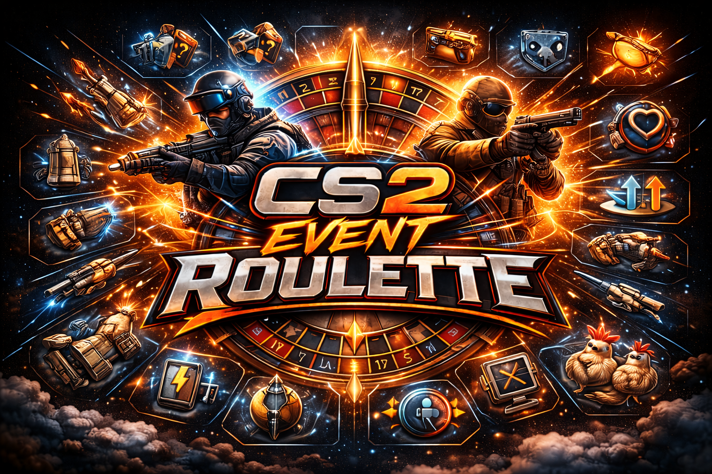

# CS2 Event Roulette

`CS2 Event Roulette` is a Counter-Strike 2 plugin for CounterStrikeSharp that rotates one custom round modifier at a time. It includes classic rounds like Low Gravity and Tank, visibility rounds like Inception and X-Ray Goggles, grenade variants like Grenade Roulette, Rainbow Smokes, and Toxic Green Smokes, and a curated Mayhem recipe round.

## Highlights

- 26 standard rounds plus Mayhem
- Admin commands and menu support
- Configurable tuning for gravity, speed, health, FOV, size, chickens, grenades, and bomb behavior
- Refactored event architecture with grouped event modules under `events/`
- Shared utilities extracted under `helpers/` so the main plugin stays focused on orchestration

## Quick Start

1. Install [CounterStrikeSharp](https://docs.cssharp.dev/docs/guides/getting-started.html) and Metamod on your server.
2. Build or download the plugin release package.
3. Copy the plugin files into `csgo/addons/counterstrikesharp/plugins/RandomRoundEvents`.
4. Copy `RandomRoundEvents.json` into `csgo/addons/counterstrikesharp/configs/plugins/RandomRoundEvents/`.
5. Restart the server or reload the plugin.

## Repo Layout

Public branding uses `CS2 Event Roulette`, while the current code/plugin file names still use `RandomRoundEvents`.

- [RandomRoundEvents.cs](RandomRoundEvents.cs) - main plugin orchestrator
- [events](events) - grouped event modules and special-case rounds
- [helpers](helpers) - shared player, weapon, and settings utilities
- [RandomRoundEvents.json](RandomRoundEvents.json) - sample config
- [docs/README.md](docs/README.md) - full commands, config, build, and release docs
- [docs/BACKLOG.md](docs/BACKLOG.md) - active issues, retest items, and future ideas

## Included Rounds

Standard rounds:

- Low Gravity
- Juan Deag
- Random Weapon
- Double Damage
- Team Swap
- Flashbang Spam
- Knife-Only
- Zeus-Only
- No Reload
- Gravity Switch
- Speed Randomizer
- Last Man Standing
- Power-Up Round
- Tank Round
- Invisible Round
- Respawn Round
- Vampire Round
- Inception Round
- X-Ray Goggles Round
- Size Randomizer Round
- Chicken Leader Round
- Return to Sender Round
- Grenade Roulette Round
- Rainbow Smokes Round
- Toxic Green Smokes Round
- Clown Grenades Round

Special round:

- Mayhem Round

## Development

```powershell
dotnet restore
dotnet build RandomRoundEvents.csproj -c Release
```

For installation, commands, release packaging, and project notes, see [docs/README.md](docs/README.md).
